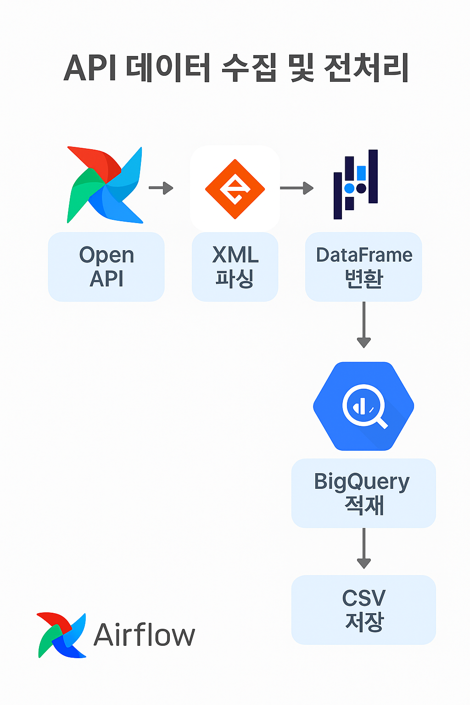

# 🌱 공공 데이터 기반 '대기오염 실시간 분석 자동화' 프로젝트

### 분석 카테고리: 데이터 엔지니어링 · 프로덕트 데이터 분석
> **분석 기간** &nbsp;|&nbsp;  2025.07.03 - 2025.07.08 <br/>
> **분석 주체** &nbsp;|&nbsp;  개인 프로젝트 <br/>
> **분석 기법** &nbsp;|&nbsp;  API 데이터 수집 자동화, ETL 파이프라인 구축, 시계열 데이터 분석, 실시간 데이터 적재 및 시각화 <br/>
> **분석 기술** &nbsp;|&nbsp;        

---

## 0. 프로젝트 구성 안내

### 📂 디렉토리 구조

```plaintext
📁 air_quality_data_pipeline/
 ┣ 📁 data/                  API 응답 데이터 및 CSV 파일
 ┣ 📁 dags/                  Airflow DAG 코드
 ┣ 📁 notebooks/             데이터 수집 및 전처리 Colab 노트북
 ┣ 📁 images/                시각화 결과 (막대 그래프, 지도 등)
 ┣ 📁 reports/               분석 보고서 및 PPT 자료
 ┣ 📄 README.md              프로젝트 설명 문서
 ┣ 📄 requirements.txt       사용한 Python 패키지 목록
 ┗ 📄 codebook.xlsx          데이터 정의서 (Code Book)
```

---

## 1. 프로젝트 개요  

### 📌  세 줄 요약  
- 공공데이터포털의 에어코리아 대기오염 API를 활용해 실시간 대기오염 데이터를 수집하고 BigQuery에 적재했습니다.  
- Airflow를 활용한 ETL 파이프라인을 구성해 데이터 적재를 자동화했습니다.  
- 수집된 데이터를 바탕으로 지역별 오염도 패턴 분석 및 시각화를 진행했습니다.  

---

## 2. 문제 정의 및 접근 방식  

### 🔍 **Situation**  
- 데이터 분석 부서가 시도별 대기오염 정보를 실시간으로 조회하고 분석할 수 있는 시스템 필요  
- 데이터가 지속적으로 갱신되므로 수작업 다운로드는 비효율적임  

### 💡 **Task**  
- API에서 데이터를 호출하여 실시간 적재 및 자동화 파이프라인을 구축  

### 🏃 **Action**  
- 공공데이터포털 Open API 호출 및 XML 데이터 파싱  
- 전처리 후 BigQuery에 데이터 적재 (google-cloud-bigquery 활용)  
- Airflow DAG 구성으로 ETL 자동화 및 스케줄링 수행  
- BigQuery에서 쿼리 분석 및 지역별 대기오염 트렌드 시각화  

### 🚀 **Result**  
- 실시간 데이터 적재 자동화 성공 (Airflow 스케줄링)  
- BigQuery 기반 대기오염 분석으로 시간·지역별 오염 패턴 도출  
- 분석 부서에서 바로 사용할 수 있는 데이터 파이프라인 제공  

---

## 3. 프로젝트 진행  

### 3-1) 📡 API 데이터 수집 및 전처리  
- Open API 승인 → XML 데이터 파싱 → pandas DataFrame 변환  
- 주요 변수: SO2, CO, O3, NO2, PM10, PM2.5 등 대기오염 지표  
- 결과 데이터 CSV 저장 및 BigQuery 적재  

  

---

### 3-2) 🛠 ETL 파이프라인 구축 및 Airflow 스케줄링  
- Airflow DAG 구성: PythonOperator로 API 호출 → 데이터 가공 → BigQuery 적재 자동화  
- DAG 실행 주기: 매 1시간마다 데이터 수집 및 적재  

📄 삽입 이미지: `images/airflow_dag_schedule.png`  

---

### 3-3) 📈 분석 및 시각화  
- BigQuery를 통한 SQL 쿼리 분석  
- 지역별 대기오염 농도 변화 트렌드 분석  
- 시간대별 오염물질 농도 분포 시각화  

📄 삽입 이미지: `images/air_quality_trend_bar_chart.png`  
📄 삽입 이미지: `images/region_air_pollution_map.png`  

---

## 4. 프로젝트 회고

### ✏️ Learned Lessons
- 공공 데이터 API를 활용한 데이터 수집-적재-분석의 전 과정을 경험  
- Airflow DAG 구성과 스케줄링을 통해 데이터 파이프라인의 중요성 체감  
- 실시간 데이터 분석으로 운영팀의 인사이트 도출 가능성을 확인  


